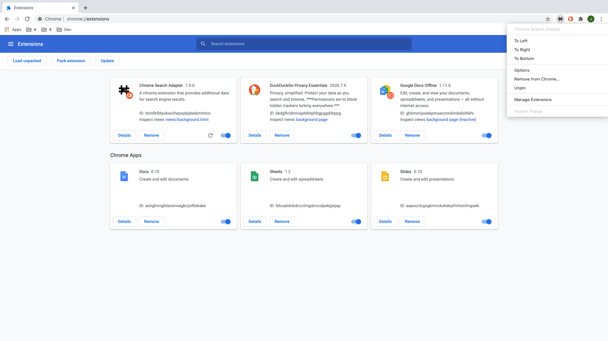

# Chrome Web Browser Adapter

The `Chrome Web Browser Adapter` is a Google Chrome browser extension that provides the user with context-aware UI, while browsing the web, to connect and employ custom utilities and services associated with a given context.

## Key Features

The `Chrome Web Browser Adapter` has a few key features, highlighted below:

1.) Open multiple, panel-style `Adapter window` instances:
> Each `Adapter window` instance can be opened via the extension's context menu (right-clicking the extension icon).

> Each `Adapter window` is designed to be standalone, providing context-aware UI that is capable of connecting to external data stores and services.
> Each `Adapter window` connects to the user's current context without impacting the current context UI.

2.) Configure and customize settings for the `Chrome Web Browser Adapter`:
> Configure the list of supported websites (coming soon).
> Configure the list of associated utilites and services available to a supported site (coming soon).

## Getting Started

The instructions that follow will provide the necessary steps to successfully install and run the `Chrome Web Browser Adapter`.

## Installation

To install the `Chrome Web Browser Adapter`:

1.) Download the extension adapter.

2.) Open Chrome and navigate to the [Chrome Extensions URL](chrome://extensions/).
> Ensure that the **Developer mode** is set to **active**.
> Select the **Load unpacked** option (this will load the extension into Chrome on your local machine).

3.) Check the Chrome toolbar.
> If the extension is loaded successfully, the extension icon will appear in the Chrome toolbar.

Congratulations! The `Chrome Web Browser Adapter` is now installed on your local machine and ready to go!

## Usage

The instructions that follow will provide the necessary steps to successfully run the `Chrome Web Browser Adapter`.

1.) Open a new terminal window and navigate to the project's root directory.
> npm run start

## Resources

[Extensions Overview](https://developer.chrome.com/extensions/overview)

[Extensions API Index](https://developer.chrome.com/extensions/api_index)
